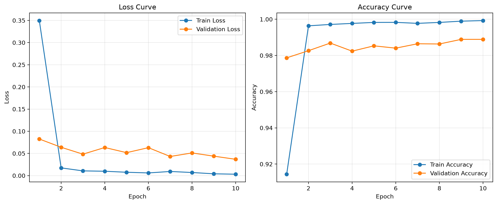
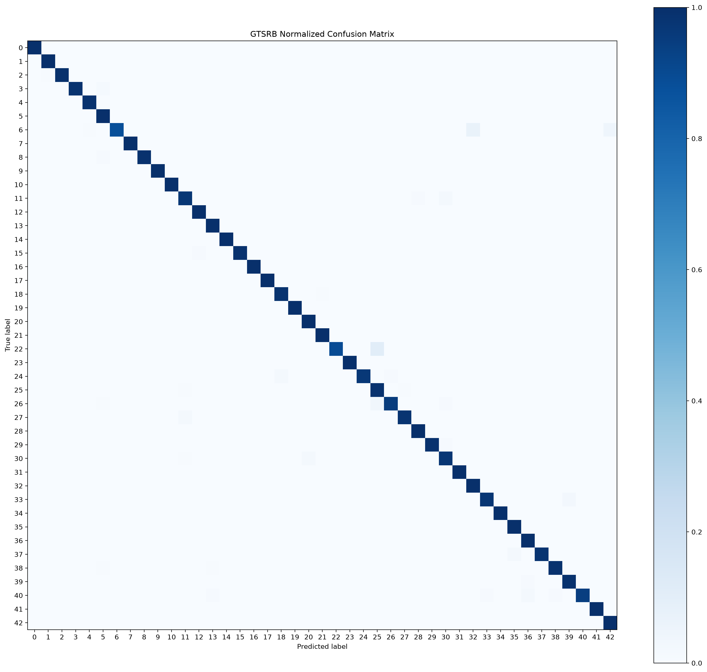
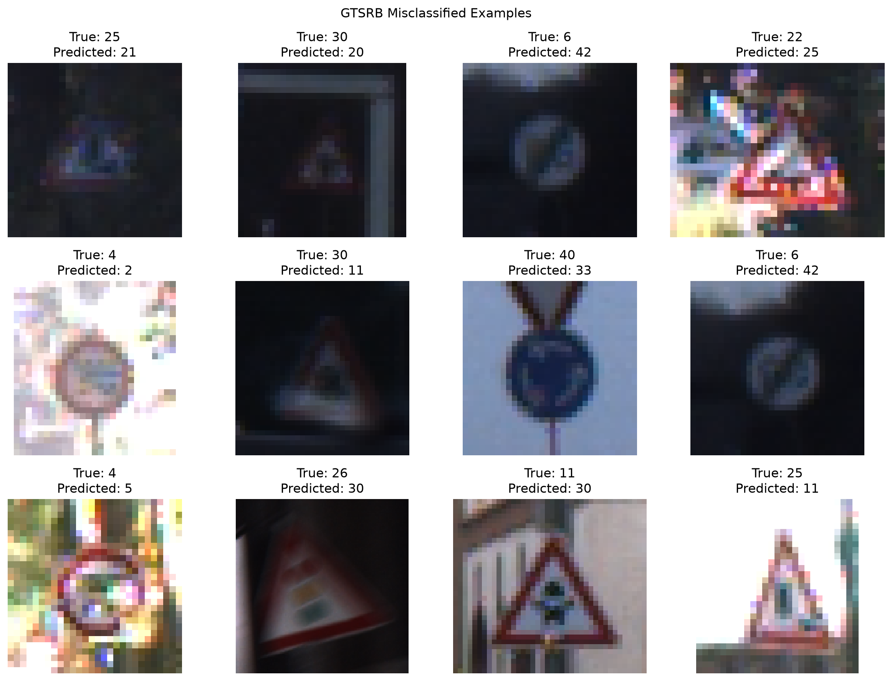

# GTSRB Traffic Sign Recognition

基于 PyTorch 和 ResNet18 实现的德国交通标志识别项目，包含数据处理、模型训练、测试集评估和单张图片预测等完整流程。

## 项目结果

| 指标 | 结果 |
| --- | ---: |
| 测试集图片数量 | 12,630 |
| 测试准确率 | 99.04% |
| Macro Precision | 98.43% |
| Macro Recall | 98.60% |
| Macro F1 | 98.47% |
| 单张图片推理时间 | 约 2.21 ms |

## 已实现功能

- GTSRB 数据集读取与统计
- 按拍摄序列划分训练集和验证集
- 自定义 Dataset 和 DataLoader
- 图像预处理与数据增强
- ResNet18 迁移学习
- 自动保存最佳模型
- 官方测试集评估
- Precision、Recall 和 F1 计算
- 混淆矩阵和错误分类案例可视化
- Loss 和 Accuracy 训练曲线
- 单张图片预测及 Top-5 结果


## 项目结构

```text
traffic-sign-adversarial-robustness/
├── data/                         # GTSRB数据集（不上传GitHub）
├── checkpoints/                  # 模型权重（不上传GitHub）
├── results/
│   ├── training_curves.png
│   ├── confusion_matrix.png
│   └── misclassified_examples.png
├── src/
│   ├── __init__.py
│   ├── dataset.py                # Dataset、数据扫描和划分
│   ├── model.py                  # ResNet18模型
│   └── class_names.py            # 43个交通标志类别名称
├── train.py                      # 模型训练
├── evaluate.py                   # 测试集评估
├── predict.py                    # 单张图片预测
├── requirements.txt
└── README.md
```

## 环境安装

推荐使用 Python 3.10 或更高版本。

```bash
git clone <你的GitHub仓库地址>
cd traffic-sign-adversarial-robustness
pip install -r requirements.txt
```

如果需要使用 NVIDIA GPU，请安装与本机 CUDA 环境匹配的 PyTorch 版本。


## 数据集准备

本项目使用 GTSRB（German Traffic Sign Recognition Benchmark）数据集，共包含 43 个交通标志类别。

需要下载并解压以下三个文件：

- `GTSRB_Final_Training_Images.zip`
- `GTSRB_Final_Test_Images.zip`
- `GTSRB_Final_Test_GT.zip`

解压后按照下面的结构放入项目的 `data` 目录：

```text
data/
├── GTSRB_Final_Training_Images/
│   └── GTSRB/
│       └── Final_Training/
│           └── Images/
├── GTSRB_Final_Test_Images/
│   └── GTSRB/
│       └── Final_Test/
│           └── Images/
└── GTSRB_Final_Test_GT/
    └── GT-final_test.csv
```

训练集包含 39,209 张图片。项目按照拍摄序列将其划分为：

- 训练集：31,379 张
- 验证集：7,830 张

官方独立测试集包含 12,630 张图片。

## 使用方法

### 训练模型

```bash
python train.py
```

训练过程会自动保存验证准确率最高的模型：

```text
checkpoints/best_resnet18.pth
```

同时生成训练和验证曲线：

```text
results/training_curves.png
```

### 测试集评估

```bash
python evaluate.py
```

评估完成后会输出 Accuracy、Precision、Recall 和 F1，并生成：

```text
results/confusion_matrix.png
results/misclassified_examples.png
```

### 单张图片预测

```bash
python predict.py --image data/GTSRB_Final_Test_Images/GTSRB/Final_Test/Images/00000.ppm
```

程序会输出预测类别、中文类别名称、置信度、Top-5 结果和推理时间。


## 可视化结果

### 训练曲线

训练 Loss 持续下降，验证准确率最终达到 98.89%。



### 混淆矩阵

归一化混淆矩阵展示了模型在43个交通标志类别上的分类表现。



### 错误分类案例

模型在官方测试集中错误分类121张图片，主要集中在低光照、模糊、过曝和标志尺寸较小的样本。




## 模型配置

| 配置项 | 设置 |
| --- | --- |
| 模型 | ResNet18 |
| 预训练权重 | ImageNet |
| 输出类别 | 43 |
| 输入尺寸 | 128 × 128 |
| Batch Size | 64 |
| Epochs | 10 |
| 优化器 | AdamW |
| 学习率 | 0.0001 |
| Weight Decay | 0.0001 |
| 损失函数 | CrossEntropyLoss |

训练阶段使用随机旋转、平移、缩放和颜色扰动进行数据增强，验证与测试阶段只进行尺寸调整、Tensor转换和ImageNet标准化。

## 模型权重

模型权重文件没有直接上传到Git仓库。运行以下命令训练后，会在 `checkpoints` 目录中生成最佳模型：

```bash
python train.py